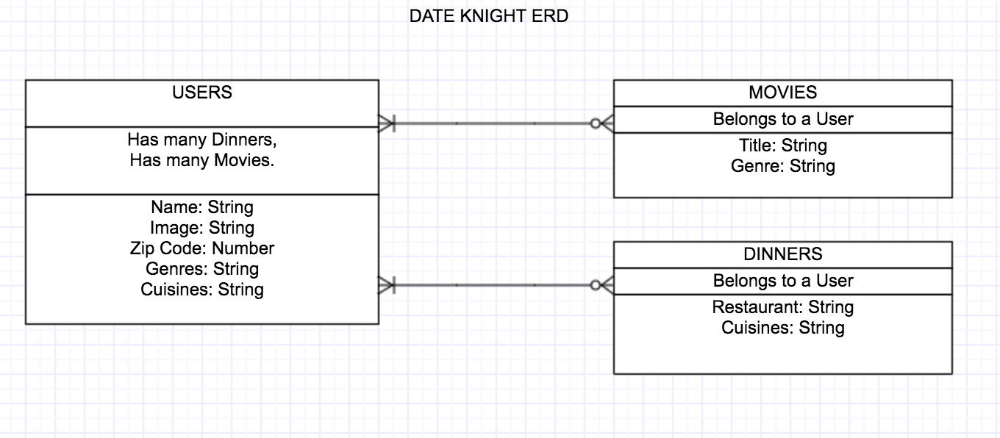

# PROJECT # 3: DATE KNIGHT

## Date Knight App

Date knight is an app that will randomly generate a movie and dinner choice for a stay at home date night.

## User Stories

* Users will have the ability to create/edit an account with user name, profile picture, zip code, movie genre preferences and cuisine preferences.
* Users will be able to save successful date night movie/dinner combinations as favorites.
* Users will be able to regenerate either movie or dinner choices if they do not like the randomly generated selections.

## Technologies Used
**The following programming languages were used.**

* HTML
* CSS
* JavaScript

**The following API were used.**

* Netflix Roulette
* Yelp

**The following Frameworks and Libraries were used.**

* Node.js
* Bootstrap
* JQuery

**The following Databases were used.**

* MongoDB with Mongoose.

**The following Packages where used.**

* Express
* EJS
* Express-EJS-Layouts
* Method-override
* Morgan
* Body-parser
* Mongoose

**The ERD for this project is below**

 