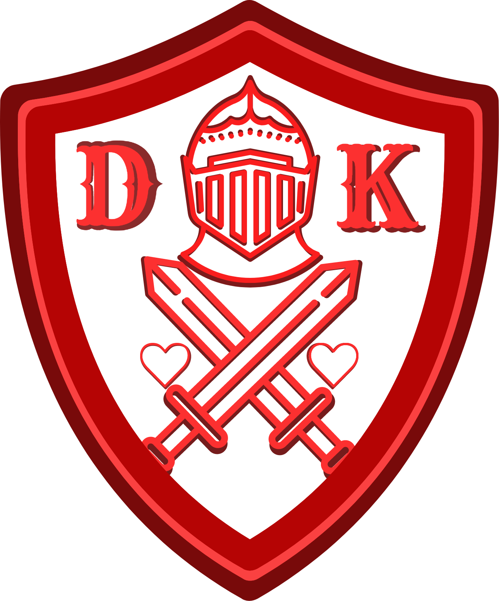
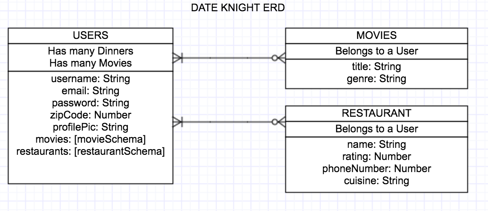
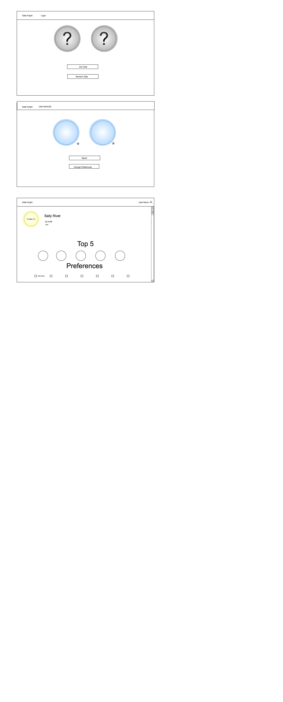

# PROJECT # 3: DATE KNIGHT

## Date Knight App

Date knight is an app that will randomly generate a movie and a dinner choice for a night out.

## User Stories

* Users will have the ability to create/edit an account with user name, profile picture, zip code, movie genre preferences and cuisine preferences.
* Users will be able to save their favorite dinners and movies.
* Users will be able to regenerate either movie or dinner choices if they do not like the randomly generated selections.

## Technologies Used
**The following programming languages were used:**

* HTML
* CSS
* JavaScript

**The following API were used:**

* Cinepass
* Yelp

**The following Frameworks and Libraries were used:**

* Node.js
* Bootstrap
* JQuery

**The following Databases were used:**

* MongoDB with Mongoose.

**The following Packages where used:**

* Express
* EJS
* Express-EJS-Layouts
* Method-override
* Morgan
* Body-parser
* Cookie-parser
* Mongoose
* Dotenv

**This app is deployed on Heroku, here is the link below:**

https://stark-stream-24550.herokuapp.com/

**The Github master repository link is below**

https://github.com/matthewnelson18/date-knight

**The ERD for this project is below:**

**The Wireframe for this project is below:**

